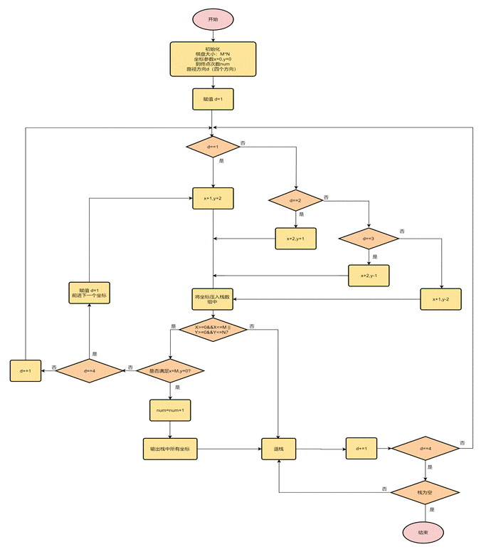
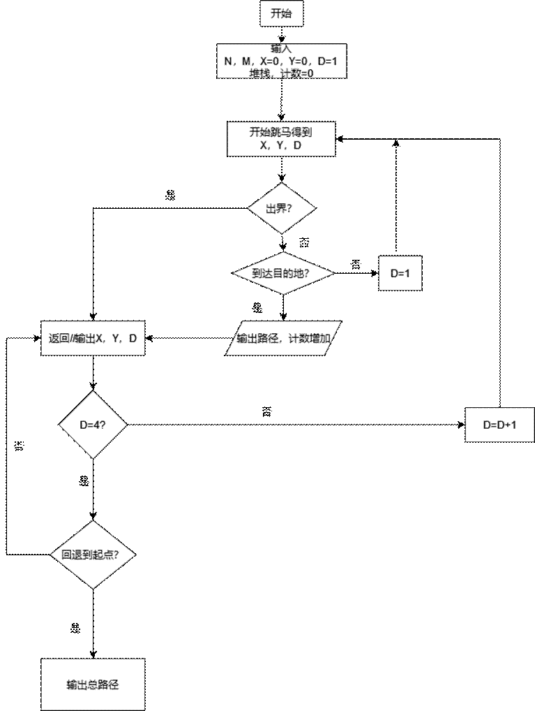
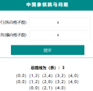
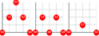
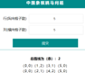
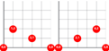
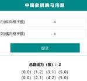

## 交叉测试——中国象棋跳马

#### **1、**功能描述

输入规定范围内的棋盘规模，点击提交即可显示所有的路线经过的坐标和在棋盘上的棋子布局

 

#### 2、开发环境版本

jquery2.1

 

#### 3、提交部门

碱基互补配对

 

#### 4、测试环境说明

 Microsoft Edge浏览器

 

#### 5、设计流程图

 

#### 6、代码逆向工程恢复流程图

 

#### 7、测试用例和结果

| 用例序号 | 用例    | 预期结果 | 测试结果                                                     | 是否正确 |
| -------- | ------- | -------- | ------------------------------------------------------------ | -------- |
| 1        | 4×4棋盘 | 3条路径  |  | 是       |
| 2        | 5×5棋盘 | 2条路径  |    | 是       |
| 3        | 5×4棋盘 | 2条路径  |                             | 是       |
| 4        | 6×6棋盘 | 12条路径 |                             | 是       |
| 5        | 7×7棋盘 | 14条路径 |                             | 是       |
| 6        | 8×8棋盘 | 54条路径 |                             | 是       |

 

